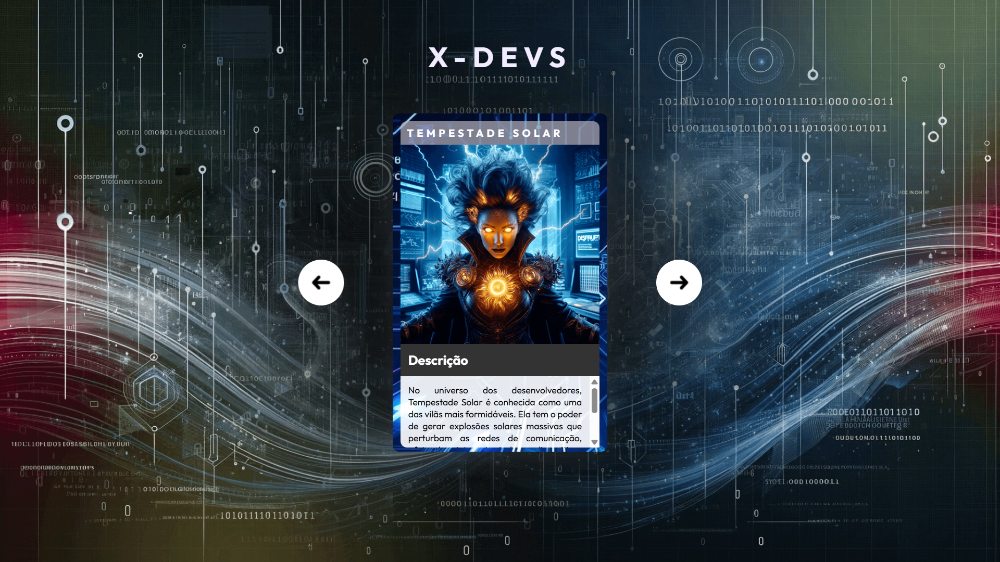

# Projeto Cards Interativos

Projeto de uma aplicação web interativa desenvolvida com **HTML5, CSS3 e JavaScript**.

O objetivo foi criar uma interface com cards de personagens, permitindo navegação entre os elementos através de interações utilizando JavaScript e manipulação do DOM.

---

## Tecnologias Utilizadas

- HTML5
- CSS3
- JavaScript
- Git
- GitHub

---

## Estrutura do Projeto

```
dev
│
├── index.html
│
└── src
    ├── css
    │   ├── reset.css
    │   ├── estilos.css
    │   └── responsivo.css
    │
    ├── imagens
    │   ├── personagens
    │   └── fundos
    │
    └── js
        └── index.js
```

---

## Funcionalidades

- Exibição de cards interativos
- Navegação entre personagens
- Botões de avançar e voltar
- Manipulação de elementos HTML através do JavaScript
- Alteração dinâmica de classes CSS
- Layout responsivo para diferentes telas

---

## Conceitos Aplicados

Neste projeto foram praticados:

- Estruturação de páginas HTML
- Organização de arquivos CSS
- Reset de estilos
- Responsividade com Media Queries
- Manipulação do DOM
- Eventos de clique
- Controle de estados utilizando JavaScript
- Organização de projetos Front-End

---

## Imagem do Projeto



---

## Como Executar

1. Clone o repositório:

```bash
git clone https://github.com/DevAndreCampos/dev.git
```

2. Abra o arquivo:

```
index.html
```

3. Execute no navegador.

---

## Objetivo

Projeto desenvolvido para aprimorar conhecimentos em desenvolvimento Front-End, principalmente interação entre HTML, CSS e JavaScript.

---

## Autor

André Campos